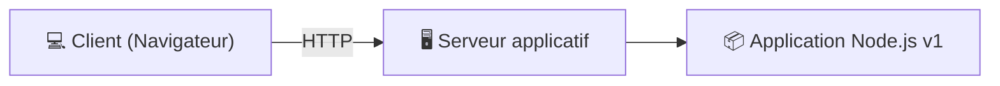
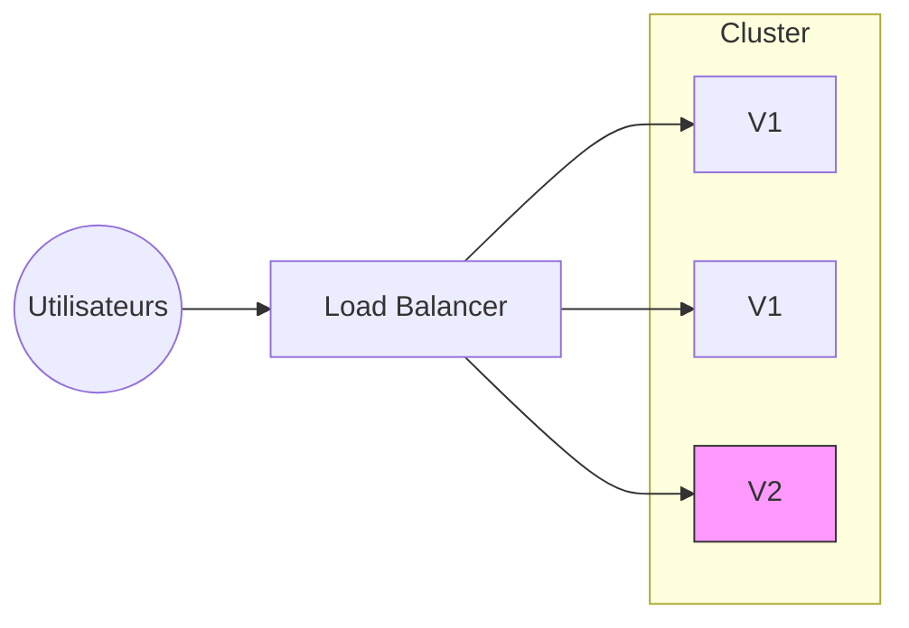
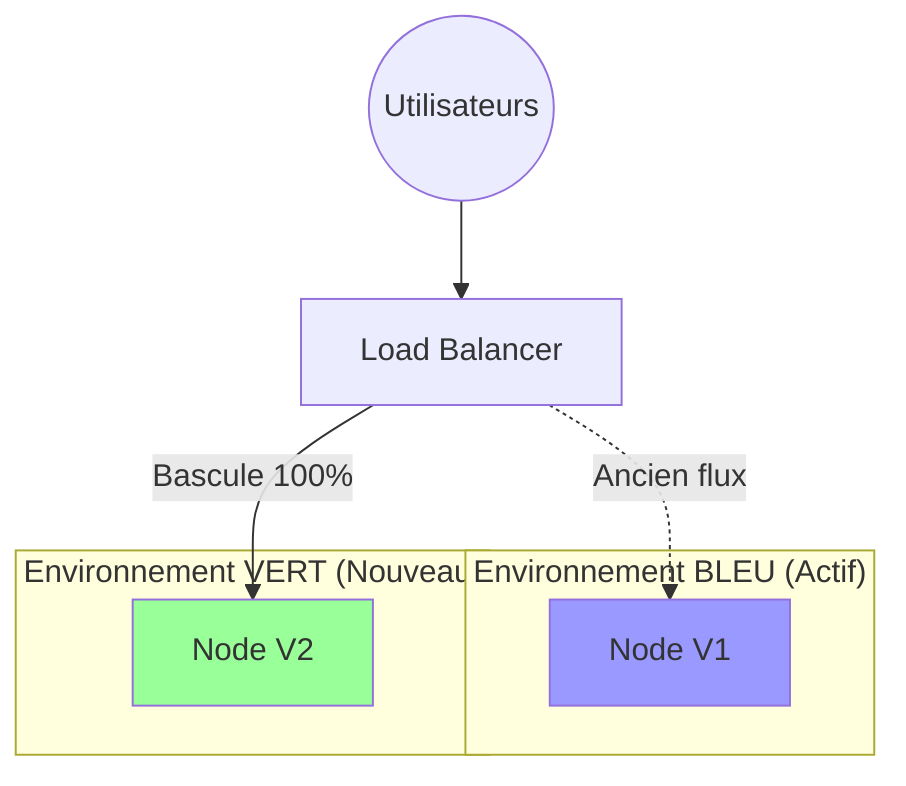
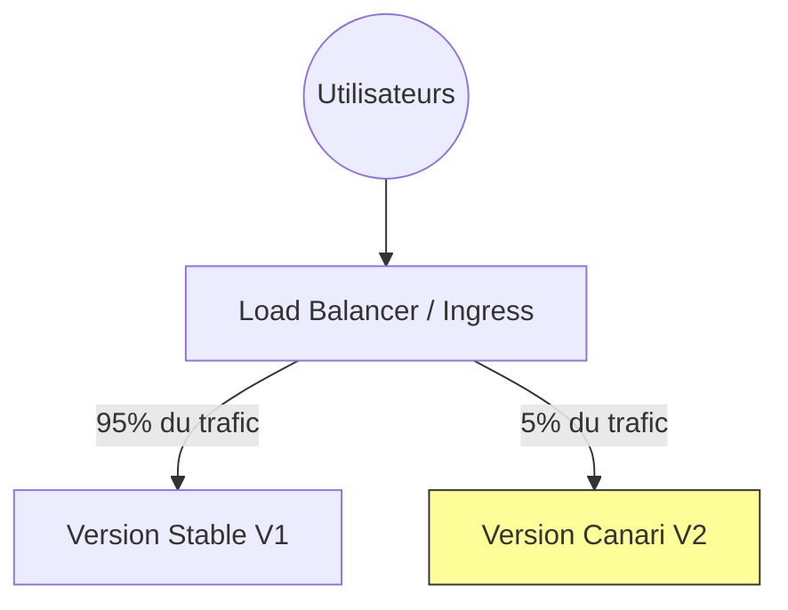

# Rappel rapide 

**Diagramme de déploiement UML** =  Représentation :

*   des **nœuds** (serveur, VM, conteneur, poste client…)
*   des **artefacts** (application, service, version)
*   des **liens réseau**
*   telle que le système est **déployé physiquement**

***

# Déploiement de base

> On dispose d’une application Node.js déployée sur un seul serveur.  
> Lors d’une mise à jour, l’application est arrêtée puis redéployée.

### Travail demandé

1.  Étudier un **diagramme de déploiement UML** du système.
2.  Repérer :
    *   le poste client,
    *   le serveur applicatif,
    *   l’application Node.js.

***

## Question 

> Quel est le principal risque de ce type de déploiement ?

***

# Déploiement progressif (rolling)

> L’application est déployée sur deux instances serveur derrière un composant de répartition de charge.  
> Les mises à jour sont effectuées instance par instance.

### Travail demandé

1.  Étudier le diagramme de déploiement.
2.  Identifier :
    *   les deux serveurs applicatifs,
    *   le composant de load balancing,
    *   les versions applicatives.
3.  En évidence la **coexistence de deux versions**.

## Question 

> Que se passe‑t‑il si la version v2 contient un bug majeur ?

***

# Déploiement bleu‑vert

> Le système utilise deux environnements complets :  
> **Bleu (production)** et **Vert (nouvelle version)**.  
> Le trafic peut être redirigé instantanément de l’un vers l’autre.

### Travail demandé

1.  Étudier le diagramme de déploiement.
2.  Noter la séparation claire :
    *   environnement Bleu
    *   environnement Vert
3.  Repérer le **point unique de bascule**.

## Question 

> Pourquoi ce type de déploiement est‑il apprécié dans les systèmes critiques ?

***

# Déploiement canari

> Une nouvelle version est déployée sur un nombre limité d’instances afin de tester son comportement en production.

### Travail demandé

1.  Étudier le diagramme de déploiement.
2.  Repérer :
    *   les instances “stables”,
    *   l’instance canari,
    *   le contrôle du trafic.
3.  Noter la proportion approximative de trafic.

## Question 

> Quelle différence entre déploiement progressif et canari ?

***

# Exercice de synthèse 

### Travail demandé

À partir des 4 diagrammes, compléter un tableau comparatif :

*   continuité de service
*   facilité de rollback
*   coût infrastructure
*   complexité

> Quel déploiement recommanderiez-vous pour une application métier en production ? 
> Pourquoi ?

***

## Bonus 

*   Refaire les diagrammes avec :
    *   **Docker**
    *   **Kubernetes**
*   Ajouter la **base de données**
*   Mettre en évidence les dépendances partagées
